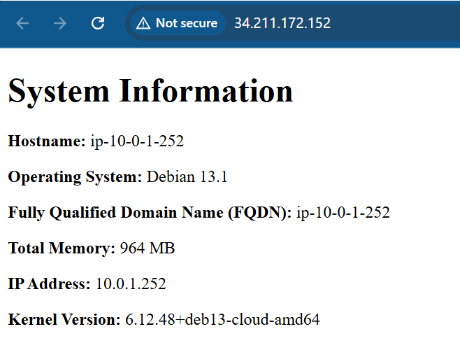

# Week 07 Lab - Ansible

This repo contains the Ansible scripts for deploying **Nginx** on two AWS EC2 instances using **Terraform** and **Ansible**.

---

## SSH Key Setup

### 1. Create a new SSH key pair named `aws`
```bash
ssh-keygen -t ed25519 -f ~/.ssh/aws -C "lab-07-ansible"
```

### 2. Import the public key to AWS so Terraform can use it
```bash
./scripts/import_lab_key ~/.ssh/aws.pub
```

### 3. Terraform Commands
Run these Terraform commands from the ```terraform``` directory:

- Initizlizes Terraform:
```bash
terraform init
```
- Format Terraform files:
```bash
terraform fmt
```
- Validate Terraform configuration:
```bash
terraform validate
```
- Generate and review Terraform plan:
```bash
terraform plan -out=tfplan
```
- Apply Terraform plan:
```bash
terraform apply -auto-approve
```

### 3. Ansible Commands
Run these Ansible commands from the ```ansible``` directory:

- Check Ansible playbook syntax:
```bash
ansible-playbook --syntax-check playbook.yml
```
- Verify connection to the managed nodes:
```bash
ansible all -m ansible.builtin.ping
```
- Run Ansible playbook:
```bash
ansible-playbook playbook.yml
```

